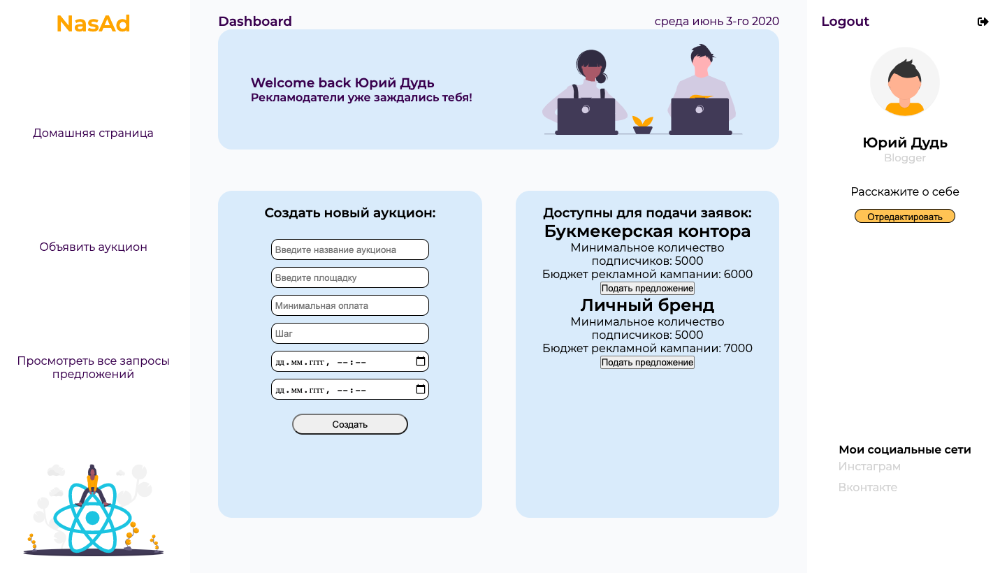
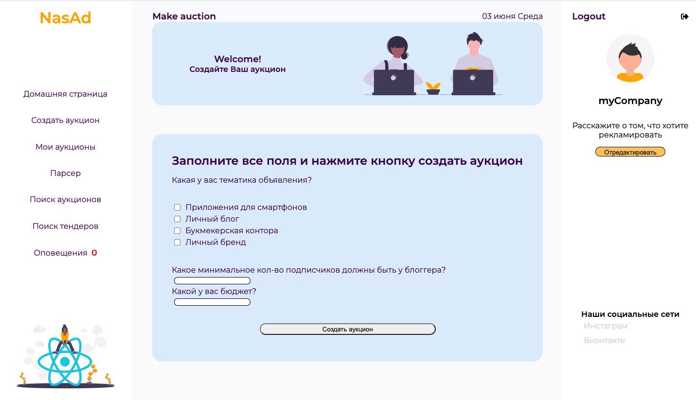

# NasAd
**NasAd** – платформа объединяющая блогеров и рекламодателей.

## Getting Started
```sh
$ npm install  
$ npm start
```

### MVP блогера
  + Создание аукционов 
  + Отслеживание запросов на закупку рекламы
  + Отслеживание хода торгов в реальном времени

  
 ### MVP организации
  + Участие в аукционах
  + Поиск по объявленным аукционам
  + Создание запросов предложений
  + Просмотр статистики группы в Вконтакте с помощью парсера

  
### Используемые технологии:
Фронт приложения реализован при помощи:

* React/ Redux / Thunk
* HTML 5/ CSS 3

Бэк:

* Node.js, Express
* MongoDB, mongoose
* WebSocets

### Как это выглядит:
  
  ____
  
  ____
  
  ____
  
  

